# IAM Identity Lifecycle Lab

## Objective
Demonstrate joiner, mover, and leaver identity lifecycle using Microsoft Entra ID with authentication, MFA enforcement, and audit logging.

## Environment
- Microsoft Entra ID (Free Tenant)
- Windows Desktop
- Browser-based administration

## Status
Project completed.

## Joiner (New User Onboarding)
- Created new user accounts in Entra ID
- Assigned users to security groups to represent role-based access
- Completed first-time sign-in and password reset
- Enrolled users in MFA as required by Security Defaults
- Verified successful authentication events in sign-in logs
  
**Outcome:** User authenticated successfully with MFA and received group-based access.
  
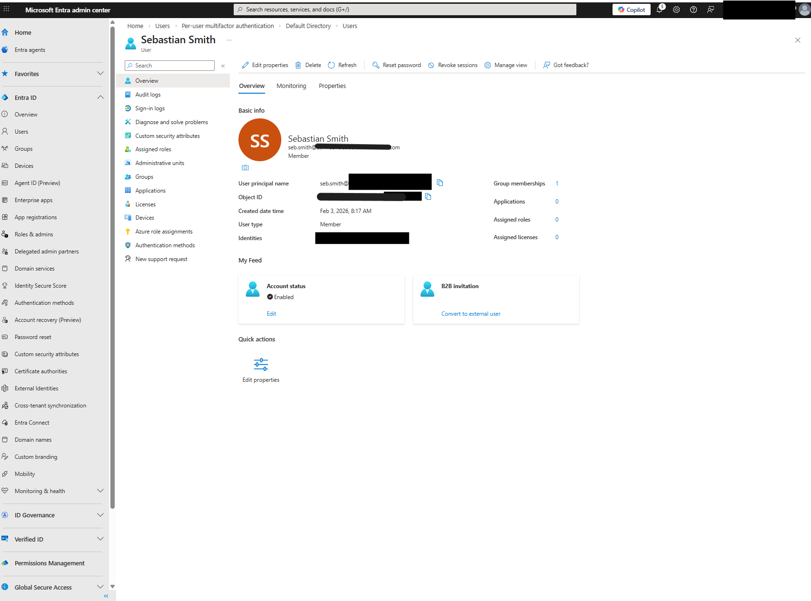
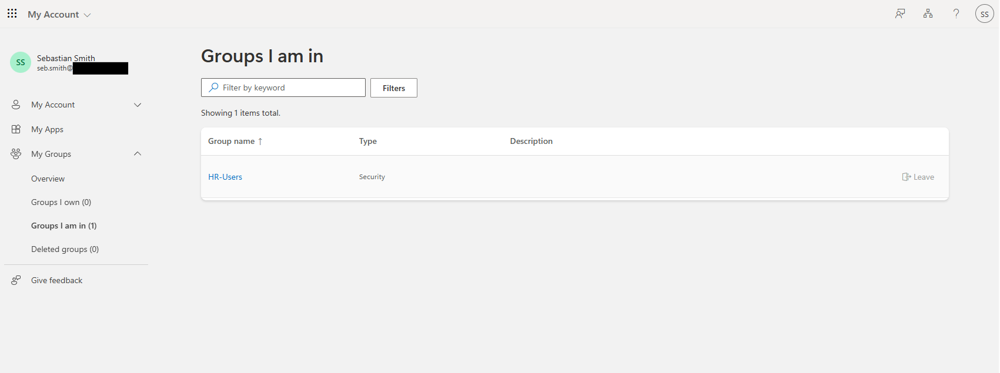
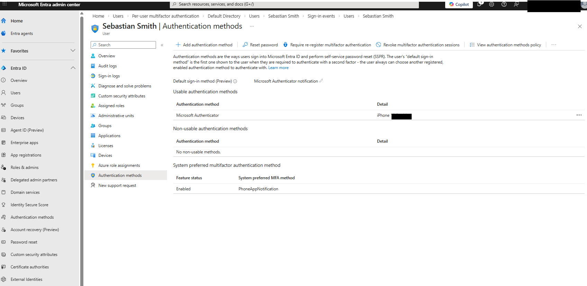
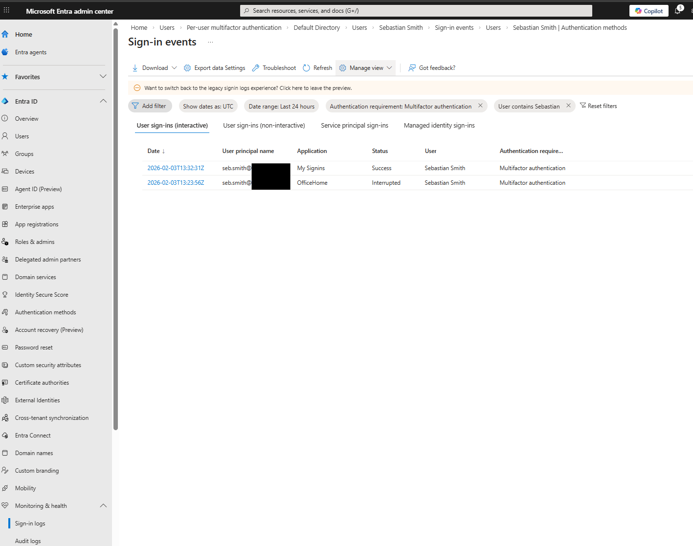

## Mover (Role / Access Change)
- Removed user from original security group
- Assigned user to a new security group representing a role change
- Validated updated group membership
- Confirmed changes recorded in audit logs

**Outcome:** Access updated without recreating the user account.

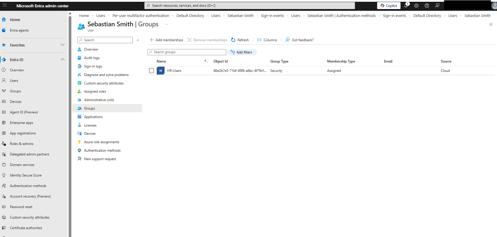
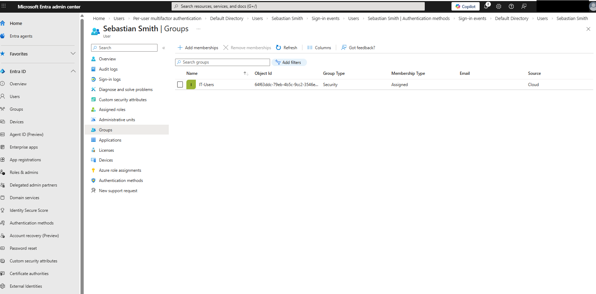
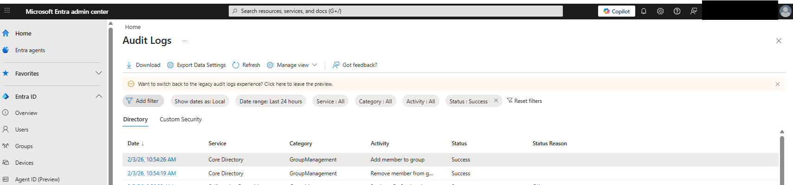

## Leaver (Offboarding)
- Blocked user sign-in
- Reset credentials
- Removed all group memberships
- Deleted user account
- Attempted sign-in to confirm access denial
- Verified actions in audit and sign-in logs

**Outcome:** User access fully revoked with auditable evidence.

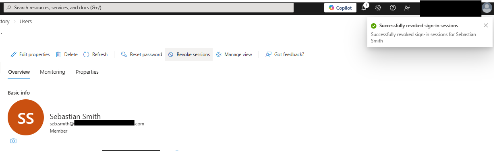
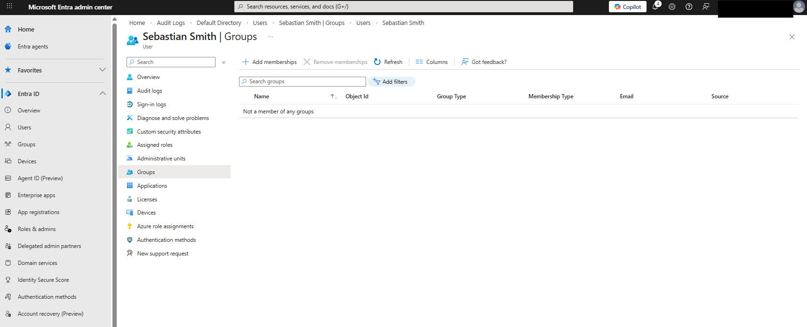
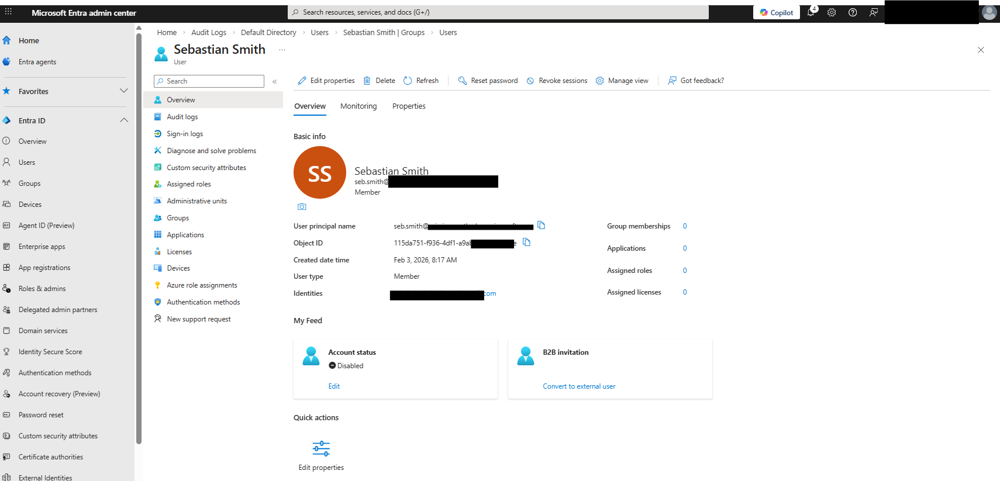
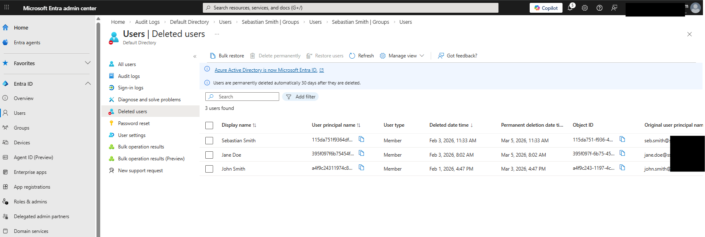
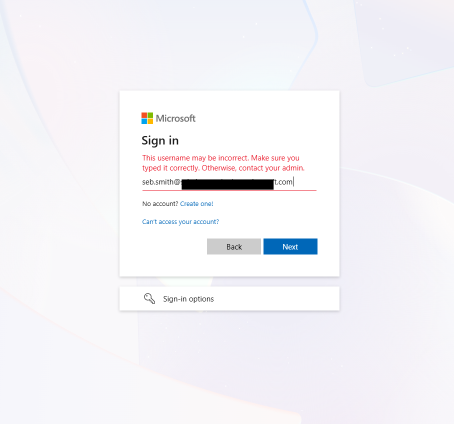

## Logging & Audit Review

- Reviewed Entra ID audit logs for lifecycle events
- Verified authentication and MFA enforcement
- Confirmed audit visibility for all actions

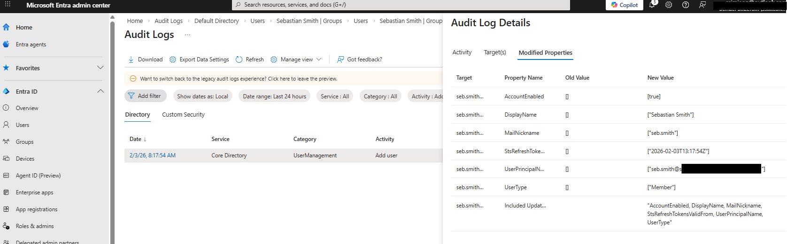
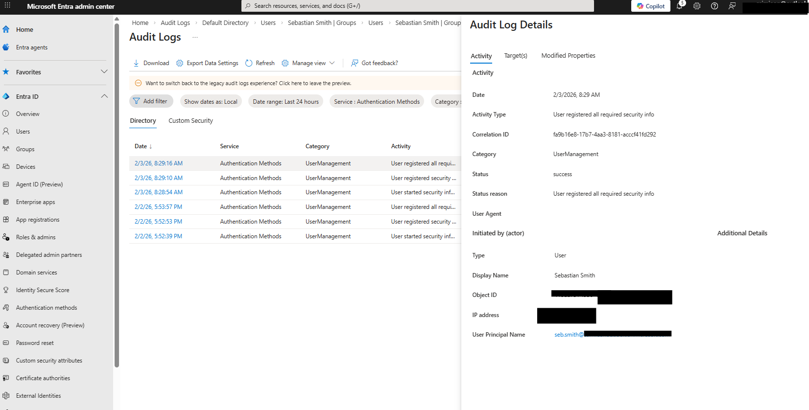
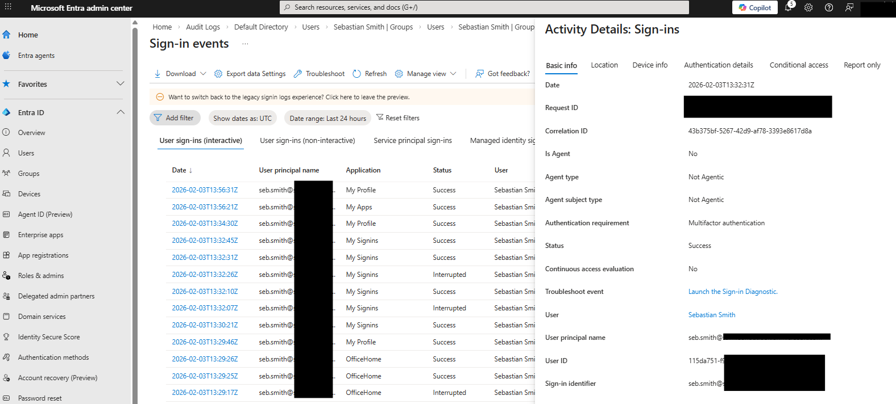
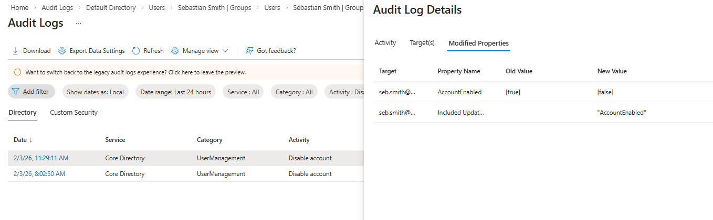
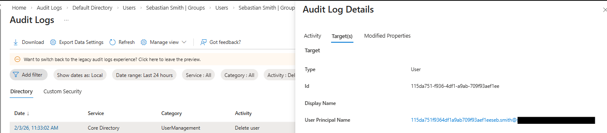
